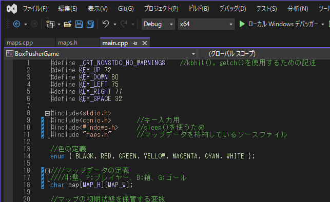

# BoxPusherGame

## 概要
Box Pusher Gameは、クラシックなパズルゲーム「倉庫番」のようなゲームです。プレイヤーは、箱を特定の位置に押し移動させることでステージをクリアします。c言語の学習のために作成しました。  
CUIで文字ベースで動作します。  
Windowsで動作します。

## ゲームプレイ
ゲームの目的は、全ての箱(`B`)をゴール(`G`)位置に移動させることです。プレイヤー(`P`)はキーボードの矢印キーを使って操作します。  
スペースキー(`SPACE`)を押すとマップがリセットされます。

## ゲームのセットアップと実行
このゲームを実際に動かすには以下の手順を行ってください。Windows出ないと動作しないと思います。

### ダウンロード
1. GitHubからzipでダウンロードするか、クローンする。  

### Visual Studioでのプロジェクトのセットアップ
1. ダウンロードしたフォルダを解凍するか、またはクローンしたリポジトリのディレクトリに移動します。  

1. Visual Studioを開き、「ファイル」>「開く」>「プロジェクト/ソリューション」を選択します。  
1. BoxPusherGame.slnファイルを選択してプロジェクトを開きます。  

### ゲームの実行
1. Visual StudioでBoxPusherGameプロジェクトが開かれた状態で、「デバッグ」メニューから「デバッグ開始」を選択するか、F5キーを押してデバッグを開始します。  

1. コンソールウィンドウが開き、ゲームが起動します。  
